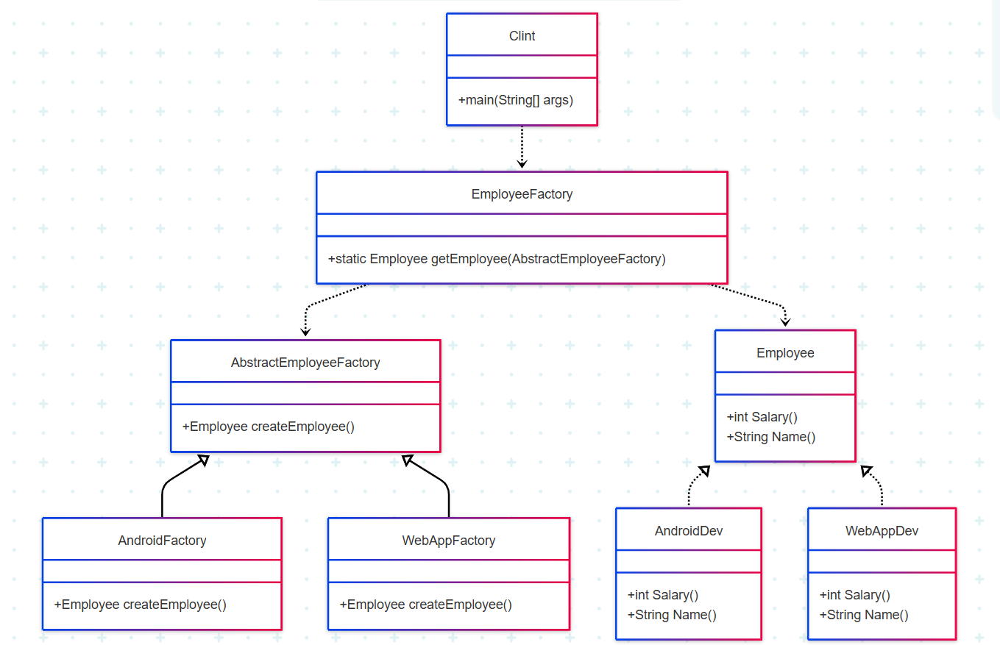

# Abstract Factory Pattern Example in Java

This project demonstrates the **Abstract Factory Design Pattern** for creating different types of `Employee` objects (Android Developer and Web Application Developer) without specifying their concrete classes.

---

## Project Structure

```
AbstractEmployeeFactory.java
AndroidDev.java
AndroidFactory.java
Clint.java
Employee.java
EmployeeFactory.java
WebAppDev.java
WebAppFactory.java
```

---

## UML Class Diagram




## Code Explanation

### 1. [`Employee`](Employee.java)

Defines the contract for all employees.

```java
public interface Employee {
    int Salary();
    String Name();
}
```

---

### 2. [`AndroidDev`](AndroidDev.java) and [`WebAppDev`](WebAppDev.java)

Concrete implementations of `Employee`.

```java
public class AndroidDev implements Employee {
    @Override
    public int Salary() { return 8000; }
    @Override
    public String Name() {
        System.out.println("I am Android Developer");
        return "I am Android Developer";
    }
}
```

```java
public class WebAppDev implements Employee {
    @Override
    public int Salary() { return 5000; }
    @Override
    public String Name() {
        System.out.println("I am Web Application Developer");
        return "I am Web Application Developer";
    }
}
```

---

### 3. [`AbstractEmployeeFactory`](AbstractEmployeeFactory.java)

Abstract factory for creating employees.

```java
abstract public class AbstractEmployeeFactory {
    abstract public Employee createEmployee();
}
```

---

### 4. [`AndroidFactory`](AndroidFactory.java) and [`WebAppFactory`](WebAppFactory.java)

Concrete factories for each employee type.

```java
public class AndroidFactory extends AbstractEmployeeFactory {
    @Override
    public Employee createEmployee() {
        return new AndroidDev();
    }
}
```

```java
public class WebAppFactory extends AbstractEmployeeFactory {
    @Override
    public Employee createEmployee() {
        return new WebAppDev();
    }
}
```

---

### 5. [`EmployeeFactory`](EmployeeFactory.java)

Static factory to get employees using the abstract factory.

```java
public class EmployeeFactory {
    public static Employee getEmployee(AbstractEmployeeFactory factory){
        return factory.createEmployee();
    }
}
```

---

### 6. [`Clint`](Clint.java)

Client code demonstrating the pattern.

```java
public class Clint {
    public static void main(String[] args) {
        Employee e1 = EmployeeFactory.getEmployee(new AndroidFactory());
        e1.Name();
        System.out.println(e1.Salary());

        Employee ee2 = EmployeeFactory.getEmployee(new WebAppFactory());
        ee2.Name();
        System.out.println(ee2.Salary());
    }
}
```

---

## How It Works

- The client (`Clint`) requests an `Employee` from `EmployeeFactory`, passing a specific factory (`AndroidFactory` or `WebAppFactory`).
- Each factory knows how to create its respective `Employee` type.
- The client code is decoupled from the concrete classes of employees.

---

## Output

```
I am Android Developer
8000
I am Web Application Developer
5000
```

---

## Summary

This project is a classic example of the **Abstract Factory Pattern**, allowing you to create families of related objects without specifying their concrete classes. This makes the code extensible and easy to maintain.
