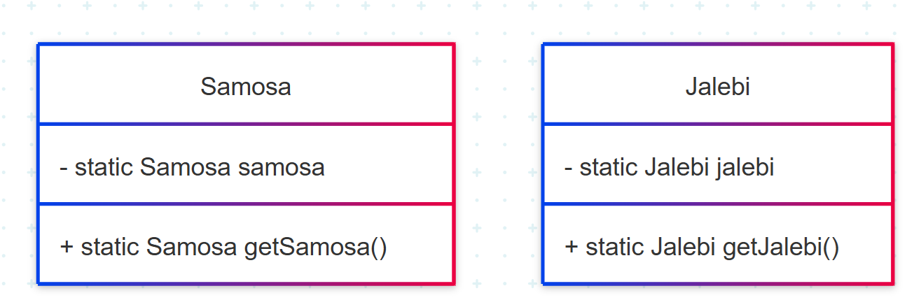

# Singleton Pattern in Java

This project demonstrates the Singleton Design Pattern in Java using two approaches:
- **Lazy Initialization** (with thread safety) via the `Samosa` class.
- **Eager Initialization** via the `Jalebi` class.

---

## What is the Singleton Pattern?

The Singleton Pattern ensures that a class has only one instance and provides a global point of access to it. This is useful when exactly one object is needed to coordinate actions across the system, such as a configuration manager or a connection pool.

---

## UML Diagram (Mermaid)



---

## Code Explanation

### 1. `Samosa`: Lazy Initialization Singleton

- **Lazy Initialization**: The instance is created only when it is needed.
- **Thread Safety**: Uses double-checked locking with `synchronized` to ensure only one instance is created in a multi-threaded environment.
- **Private Constructor**: Prevents direct instantiation from outside the class.

```java
public class Samosa {
    private static Samosa samosa;

    private Samosa() {
        // private constructor to prevent instantiation
    }

    public static Samosa getSamosa(){
        if (samosa == null) {
            synchronized(Samosa.class){
                if (samosa == null) {
                    samosa = new Samosa();
                }
            }
        }
        return samosa;
    }
}
```

- The first `if` checks if the instance is null.
- The `synchronized` block ensures only one thread can enter at a time.
- The second `if` inside the block checks again to avoid multiple instantiations.
- The constructor is private to prevent direct instantiation.

---

### 2. `Jalebi`: Eager Initialization Singleton

- **Eager Initialization**: The instance is created at the time of class loading.
- **Thread Safety**: Guaranteed by the class loader.
- **Private Constructor**: Prevents direct instantiation from outside the class.

```java
public class Jalebi {
    private static Jalebi jalebi = new Jalebi();

    private Jalebi() {
        // private constructor to prevent instantiation
    }

    public static Jalebi getJalebi(){
        return jalebi;
    }
}
```

- The instance is created when the class is loaded, ensuring thread safety by default.
- The constructor is private to prevent direct instantiation.

---

### 3. `Singleton`: Testing the Singleton Classes

```java
class Singleton {
    public static void main(String[] args) {
        // Lazy Initialization Singleton
        Samosa samosa1 = Samosa.getSamosa();
        System.out.println(samosa1.hashCode());

        Samosa samosa2 = Samosa.getSamosa();
        System.out.println(samosa2.hashCode());

        // Eager Initialization Singleton
        Jalebi jalebi1 = Jalebi.getJalebi();
        System.out.println(jalebi1.hashCode());

        Jalebi jalebi2 = Jalebi.getJalebi();
        System.out.println(jalebi2.hashCode());
    }
}
```

- Both `samosa1` and `samosa2` will have the same hash code, proving only one instance is created for `Samosa`.
- Both `jalebi1` and `jalebi2` will also have the same hash code, proving only one instance is created for `Jalebi`.

---

## Summary

- **Lazy Initialization**: Instance created when needed, can be made thread-safe.
- **Eager Initialization**: Instance created at class loading, inherently thread-safe.
- Both approaches prevent direct instantiation by making the constructor private.

---

## Files

- `Samosa.java`: Lazy Singleton implementation.
- `Jalebi.java`: Eager Singleton implementation.
- `Singleton.java`: Main class to test singleton behavior.