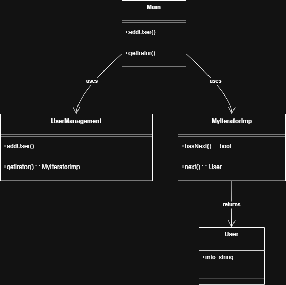

# Iterator Design Pattern
- The Iterator Design Pattern provides a way to access the elements of a collection (like a list or array) sequentially without exposing the underlying structure. It separates the logic of traversing a collection from the collection itself, making code more flexible and maintainable.

### Key Concepts:

- **Iterator**: An object that enables traversing a collection.
- **Aggregate/Collection**: The object holding the data (e.g., a list).
- **Separation of Concerns**: The collection doesn’t need to know how iteration works.

## How This Code Implements the Pattern
### 1. User
- A simple data class representing a user with userId and userName.

### 2. UserManagment
- Acts as the collection (aggregate).
- Stores a list of User objects.
- Provides methods to add users and get an iterator (getIrator()).
### 3. MyItrator (interface)
- Defines the iterator’s contract:

```java
public interface MyItrator {
    boolean hasNext();
    Object next();
}
```

### 4. MyItratorImp
- Implements the iterator logic:

- Keeps track of the current position.
hasNext() checks if more elements exist.
next() returns the next User and advances the position.


### 5. Main
#### Demonstrates usage:
- Adds users to UserManagment.
- Gets an iterator.
- Uses the iterator to print each user’s ID and name.

## UML Diagram



## Summary
- Iterator Pattern lets you traverse a collection without exposing its internal structure.
- This code cleanly separates user storage (UserManagment) from traversal logic (MyItratorImp).
- The pattern makes it easy to change how you traverse the collection without changing the collection itself.